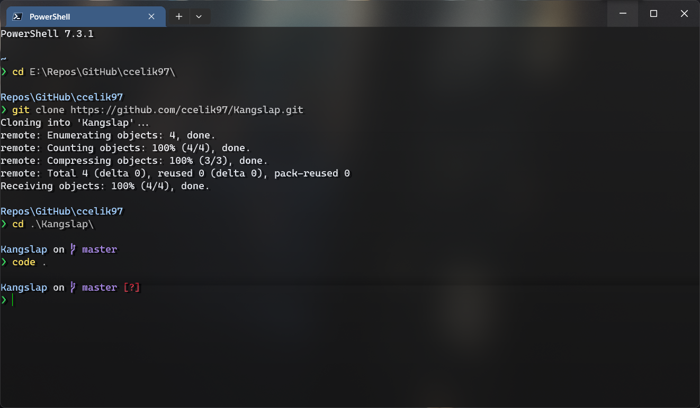
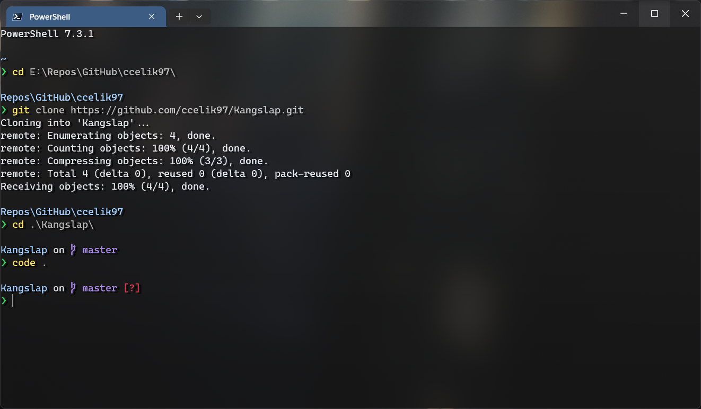
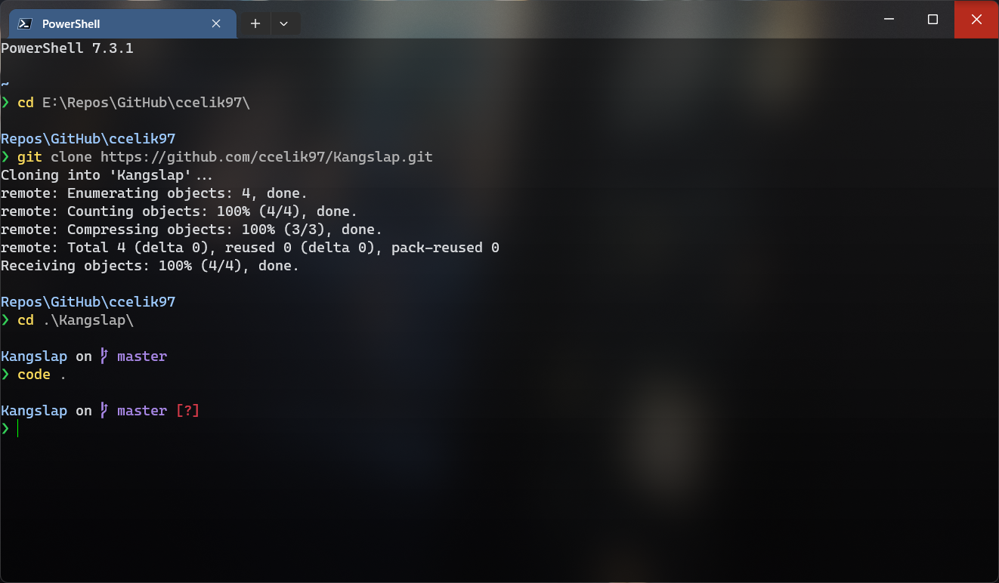

# Kangslap pixel shader for Windows Terminal

A Windows Terminal pixel shader with drop text shadow effects (w/ more readable text) & an animating refresh line (optional).

* Kangslap: Drop shadow effects & more readable text.  
* Kangslap-RefreshLine: Same as above + an animated refresh line effect (more resource intensive).

## Preview

||||
|---|---|---|
|Enabled (w/ refresh line)|Enabled|Disabled|

## Usage

Into your Windows Terminal [settings.json](https://learn.microsoft.com/en-us/windows/terminal/customize-settings/profile-general) file:

```json
{
    "profiles": {
        "defaults": {
            "antialiasingMode": "cleartype",
            "experimental.pixelShaderPath": "X:/Path/to/Kangslap.hlsl",
            "opacity": 0,
            "useAcrylic": true,
            "useAtlasEngine": false
        }
    }
}
```

and optionally:

```json
{
    "profiles": {
        "defaults": {
            "backgroundImage": "X:\\Path\\to\\wtbg.jpg",
            "backgroundImageOpacity": 0.75
        }
    }
    "useAcrylicInTabRow": true
}
```

## Credits

They're inspired by:

* @Microsoft's sample shader from: [Rasterbars.hlsl](https://github.com/microsoft/terminal/blob/main/samples/PixelShaders/Rasterbars.hlsl) and
* @Hammster's CRT shader (although falls flat of that) from: [crt.hlsl](https://github.com/Hammster/windows-terminal-shaders/blob/main/crt.hlsl).
